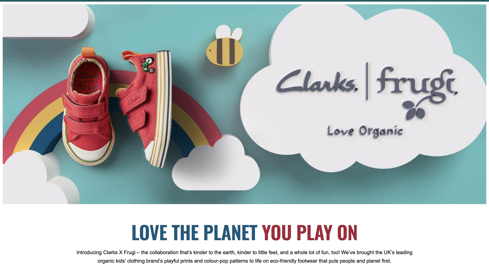

# Frugi 

## Table of contents

- [Overview](#overview)
  - [Screenshot](#screenshot)
  - [Links](#links)
- [My process](#my-process)
  - [Built with](#built-with)
- [Author](#author)

## Overview
This webpage highlights the exclusive collaboration between Frugi and Clarks, emphasizing sustainability and style. 

### Screenshot

### Links

- Solution URL: <a href="https://deed1996.github.io/Frugi/" target="_blank">https://deed1996.github.io/Frugi/</a>

## My process

### Built with

- HTML5: For structuring the content of the webpage.
- CSS3: For styling, animations and layout, including Flexbox and Grid for responsive design.
- JavaScript: For interactive elements and dynamic content loading.
- GitHub Pages: Hosting the webpage on GitHub for easy access and management.
- Responsive Web Design: Ensures the site is accessible and looks great on all devices, from desktops to mobile phones.

## Author

- Design - Designed by Clarks
- Website - Built by Devarshi Desai
